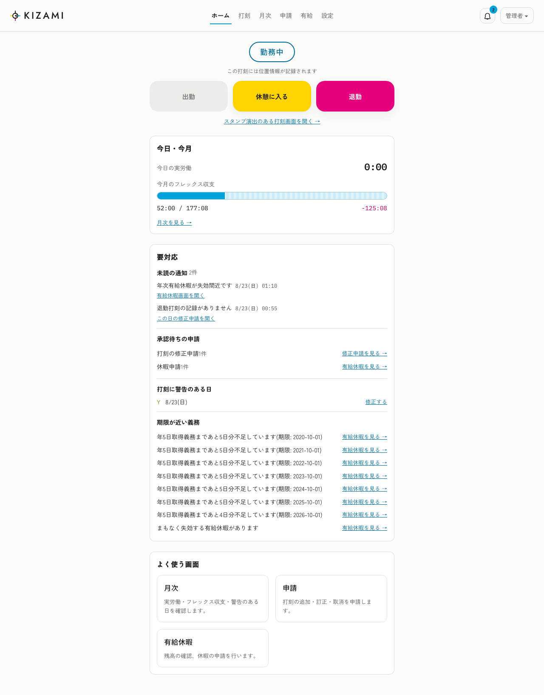
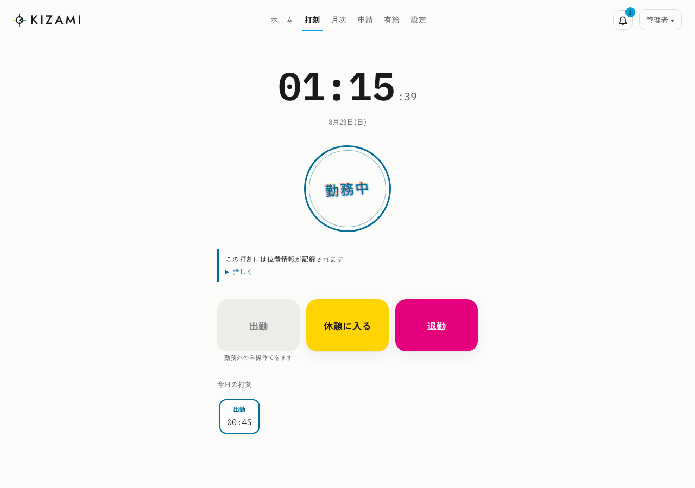
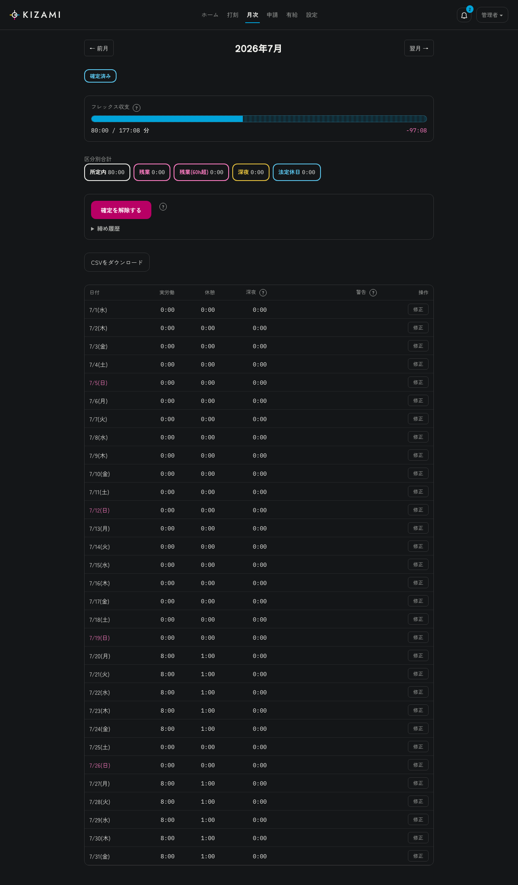
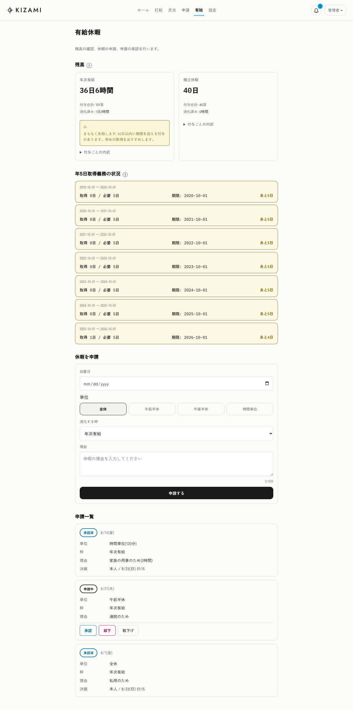

# KIZAMI

日本の労働法制に準拠した、セルフホスト可能な出退勤打刻型の勤怠管理システム。

**[kizami.dev](https://kizami.dev/)** — プロダクト紹介 / **[docs.kizami.dev](https://docs.kizami.dev/)** — ドキュメント / **[demo.kizami.dev](https://demo.kizami.dev/)** — デモ(`demo@kizami.dev` / `kizami-demo`、毎晩リセット)

**Status: beta — [v0.7.0](https://github.com/sasagar/kizami/releases/tag/v0.7.0)(最初の公開リリース)**
フレックスタイム制・固定時間制・1ヶ月単位の変形労働時間制(シフト制)、
有給休暇(法定・基準日・比例付与、付与の予告→承認→本人通知)、月次締め、監査ログ、
権限プリセット、4言語 UI(日英韓中)、MCP サーバーまで実装済み。作者環境で実運用中。
変更履歴は [CHANGELOG.md](CHANGELOG.md)、リリースとアップグレードの方針は
[docs/design/release-process.md](docs/design/release-process.md) を参照。

## なぜ KIZAMI か

既存のセルフホスト勤怠OSS(Kimai、solidtime など)は工数トラッキング寄りで、日本の勤怠慣行をカバーするものがありません。KIZAMI は次を最初から設計の中心に置きます。

- **1分単位の労働時間把握**(名前の由来。労働者不利な丸めは実装しない)
- 法定内/法定時間外/深夜/法定休日/月60時間超の**時間区分算出**
- **フレックスタイム制**(1ヶ月清算)・**固定時間制**・**1ヶ月単位の変形労働時間制**(シフトパターン・週グリッド割当・確定と変更履歴・予実乖離の警告)
- 有給休暇の付与(法定・基準日方式・**比例付与**)、**年5日取得義務の追跡**、付与の**予告→管理者承認→本人通知**(出勤率参考値つき)
- **36協定**の上限アラート(月45h・年360h・特別条項)
- 修正申請→承認+**不可変監査ログ**、休憩の検知と自動控除(本人が打ち消し申請できる)
- 招待式の登録、権限プリセット(業務タスク×スコープ)、Slack/Discord/メール/アプリ内通知
- UI は日本語・英語・韓国語・中国語(簡体)。労働法ロジックは日本専用

## 設計の要点

- 集計エンジン(`packages/engine`)は純関数・ランタイム非依存・DB非依存
- Node と Cloudflare Workers の両対応(動作保証は v1.0 要件)
- DB は SQLite 既定+PostgreSQL/D1 選択式(Drizzle)
- 権限は AWS IAM 風のプリセット方式(permission × scope、加算 + 拒否優先の deny ルール)
- スタック: TypeScript / Hono / Waku / Drizzle / Vite / Vitest / VitePress

詳細は [docs/requirements.md](docs/requirements.md) を参照。

## スクリーンショット

<p align="center">
  
  
</p>
<p align="center">
  
  
</p>

全画面(ログイン〜設定の各画面)をライト/ダーク・デスクトップ/モバイルで並べた一覧は
`pnpm screenshots` を実行すると `docs/public/screenshots/index.html` に生成されます
(手順は [撮り直す手順](#スクリーンショットの撮り直し) を参照)。

## クイックスタート(Docker Compose)

```sh
git clone https://github.com/sasagar/kizami.git && cd kizami/deploy/compose
cp .env.example .env    # KIZAMI_ENCRYPTION_KEY(openssl rand -base64 32)と初期管理者を設定
docker compose up -d
docker compose run --rm seed   # 初回のみ: 初期管理者を作成(冪等)
```

イメージは既定で `:latest` を追います。本番のセルフホストでは `.env` の `KIZAMI_TAG` に
版タグ(例 `KIZAMI_TAG=0.7.0`)を指定して固定することを推奨します
([理由と使い分け](docs/design/release-process.md))。

http://localhost:8080 にアクセスし、設定した管理者でログインしてください。
Kubernetes(k3s)での構成例は [deploy/k8s](deploy/k8s) を参照。

## リポジトリ構成

```
apps/api           Hono API サーバー
apps/web           Waku (React) フロントエンド
packages/engine    労働時間集計エンジン(純関数・ランタイム非依存)
packages/help-content  コンテキストヘルプ文言(UI・docs 共通の単一ソース)
docs               VitePress ドキュメント+要件定義
```

## 開発

```sh
pnpm install
pnpm test          # Node ランタイムで全パッケージのテスト
pnpm typecheck
pnpm test:workers  # workerd(Cloudflare Workers)+ D1 レグ
```

`pnpm test:workers` は [miniflare](https://developers.cloudflare.com/workers/testing/miniflare/) が
起動する実際の Workers ランタイム上で、ランタイム非依存パッケージのテスト・`@kizami/db` の
D1 レグ・`apps/api` の起動スモークを走らせます(Docker もクラウド接続も不要)。
何が Workers で動き何が動かないかは
[docs/design/workers-d1.md](./docs/design/workers-d1.md) を参照してください。

PostgreSQL レグを走らせたい場合は `TEST_PG_URL` を渡します
([docs/design/db-dialects.md](./docs/design/db-dialects.md))。

### スクリーンショットの撮り直し

```sh
pnpm screenshots
```

一時的な DB・API・Web サーバーを起動し、見栄えのするデモデータ(数日分の打刻・有給の
付与と取得・修正申請・通知・部署とメンバー・カスタム権限プリセット・月次締め等)を投入した
うえで、[Playwright](https://playwright.dev/) が全画面をライト/ダーク × デスクトップ/モバイルで
撮影します。撮影後はプロセス停止・一時 DB 削除まで自動で行われ、本番環境
(kizami.bktsk.com 等)には一切接続しません。Node 26 が必要です([mise](https://mise.jdx.dev/)
等で用意してください)。

- 出力先: `docs/public/screenshots/`(`.gitignore` 対象。撮り直すたびに再生成される生成物のため)
- 一覧ページ: `docs/public/screenshots/index.html` をブラウザで開くと、画面ごとにライト/ダークを
  並べて確認・拡大表示できます(デスクトップ/モバイルはタブで切り替え)
- README に載せる画像を更新したい場合は、生成された PNG から良いものを選んで
  `docs/public/readme/`(こちらはコミット対象)へ上書きコピーしてください

## License

[AGPL-3.0](LICENSE)
